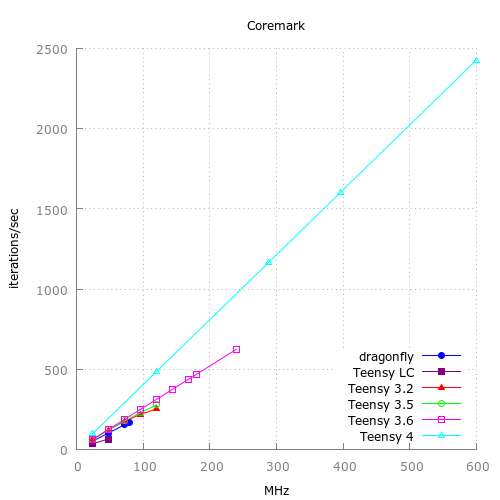
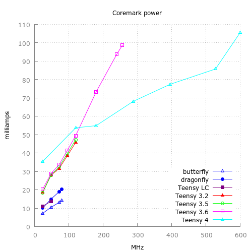

##  Teensy 4 sketches and such 

Early beta tests were with IMXRT1052, final Teensy 4 is IMXRT1062

Files | Description
---|---
acmpdac.ino  |    ACMP3 and DAC example
adcdma.ino   |    continuous ADC and DMA
adcdmapit.ino|    try to add DMA to PIT+XBAR+ADC_ETC+ADC  not working
cachetst     |    cache/no-cache from stack, OCRAM, PROGMEM
dcptst.ino   |    DCP proof-of-principle, SHA256, CRC32, and AES 
eeprom_meta |  meta data for emulated EEPROM in flash, wear leveling
flexiopwm.ino |    flexio PWM 400mhz clock?
fnet_perf.ino |  FNET TCP/UDP test using arduino API
fnet_tftpd  | FNET tftp server with SD lib adn BUILTIN_SDCARD
fnet_tftpd_SPIFFS  | FNET tftp server with SPIFFS on EFLASH
gpsgpt.ino   |    measure crystal drift of 24mhz and 32khz crystal with GPT
gpt_capture.ino | GPT1 input capture (1050) of GPS PPS signal, drift check 24mhz or 32khz
gpt_capture62.ino | GPT2 input capture (1060) of GPS PPS signal, drift check 24mhz or 32khz
gpt_count.ino   | GPT1 clocked from pin 25, like FreqCount
gpt2_count.ino   | GPT2 clocked from pin 14, like FreqCount
gpt_isr.ino  |  GPT2 compare interrupt
gpt_micros.ino |  GPT1 micros (core micros only 10 us res)
gpt_pwm.ino | GPT2 @150mhz PWM to pin 16
pit_micros64.ino | free running PIT timer 64-bit microseconds
pitxbaradc.ino |  clock ADC reads with PIT via XBAR
ppminf.ino | PPM input like PulsePosition flexpwm timer
ppmoutf.ino | PPM outpu like PulsePosition flexpwm timer NOT working
ppminq.ino | PPM input like PulsePosition quadtimer
ppmoutq.ino | PPM output like PulsePosition quadtimer
qtmr_capture.ino |quad timer capture
qtmr_cascade.ino | cascade or chain quad timer channels
qtmr_count.ino    |  quad timer count external pulses and chain to 32 bits
qtmrtst.ino    |  quad timer counting and PWM tests
rtc.ino        |  RTC off of 32 khz crystal
rtchp.ino      |  HP RTC off of 32 khz crystal, periodic sub-second alarm
spidma.ino     |  SPI DMA transmit
spidma2.ino    |  SPI DMA transmit and receive
spiperf.ino   |  SPI loopback test
sysinfo.ino    |  teensy 4 core registers
trng.ino       |  hardware TRNG example, 512 bits in 52 ms
wav2mqs.ino    |  SD WAV files to T4 MQS
wdog1.ino    |  exercise WDOG1 like SDK, ok 1050, hangs 1060

--------

Some performance comparisons at

   https://github.com/manitou48/DUEZoo

   https://forum.pjrc.com/threads/54711-Teensy-4-0-First-Beta-Test?p=194187&viewfull=1#post194187 float DSP

   https://forum.pjrc.com/threads/54711-Teensy-4-0-First-Beta-Test?p=210782&viewfull=1#post210782

   https://forum.pjrc.com/threads/54711-Teensy-4-0-First-Beta-Test?p=211593&viewfull=1#post211593  crypto

   https://github.com/manitou48/crystals   teensy 3 RTC tuning
